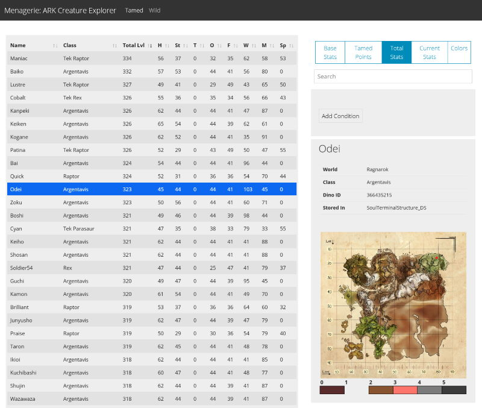

# Menagerie, a tool for exploring ARK creatures

Menagerie provides a web interface to explore all the tamed and
wild dinos and creatures across multiple ARK: Survival Evolved
game servers. It currently has no authentication, so isn't
appropriate for PvP servers.



## Running Menagerie

Menagerie is most easily run as a docker container. I use the
following config with `docker-compose`:

```
menagerie:
    image: ghcr.io/justinian/menagerie
    container_name: menagerie
    restart: always
    volumes:
       - "/home/steam/ARK/ShooterGame/Saved/Aberration:/app/saves/Aberration"
       - "/home/steam/ARK/ShooterGame/Saved/CrystalIsles:/app/saves/CrystalIsles"
       - "/home/steam/ARK/ShooterGame/Saved/Extinction:/app/saves/Extinction"
       - "/home/steam/ARK/ShooterGame/Saved/Ragnarok:/app/saves/Ragnarok"
       - "/home/steam/ARK/ShooterGame/Saved/TheIsland:/app/saves/TheIsland"
       - "/home/steam/ARK/ShooterGame/Saved/Valguero:/app/saves/Valguero"
    ports:
       - "127.0.0.1:8090:8090"
```
